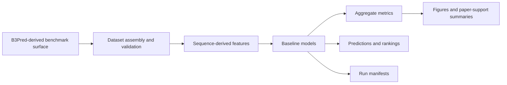

# Permea Signal ML

The first computational evidence package for sequence-first delivery engineering.

Permea Signal ML is a BBB-oriented delivery-signal benchmark support repository. It packages a reproducible workflow around the B3Pred Dataset_3 / B3Pred-derived benchmark surface, sequence-derived physicochemical features, baseline modeling, aggregate evaluation outputs, and paper-support materials.

This repository is an evidence package, not a wet-lab validation claim. It is designed to show that sequence-derived delivery-related signal can be studied under a bounded, reproducible benchmark workflow for candidate prioritization before wet-lab.

## Relationship to Permea Core

[Permea Core](https://github.com/Permea-lab/permea-core) defines the broader open technical foundation for sequence-first delivery and expression engineering: benchmark-first infrastructure, dataset and evidence conventions, run manifests, claim boundaries, and contribution objects.

Permea Signal ML applies that foundation to the first narrow evidence surface:

- a BBB-oriented peptide benchmark support package
- a B3Pred Dataset_3 / B3Pred-derived benchmark surface
- sequence-derived feature engineering
- transparent baseline models
- aggregate metrics and figures
- reproducibility checks and provenance-oriented outputs
- manuscript and supplement support files

Read this repository as a scoped evidence package connected to Permea Core, not as the whole Permea platform.

## What This Repository Contains

Permea Signal ML contains the working materials for a reproducible computational benchmark package:

- dataset workflow and BBB-oriented benchmark-surface documentation
- sequence validation and preprocessing utilities
- sequence-derived physicochemical feature extraction
- baseline model configurations and training scripts
- aggregate evaluation metrics and summary tables
- leakage-audit and leakage-aware sensitivity utilities
- candidate-ranking support scripts
- exported figures and result artifacts
- paper and supplement drafts for preprint-support review
- tests for data validation, leakage audits, grouping, split construction, and leakage-aware baselines

The current scientific framing is conservative: aggregate benchmark results may support computational evidence and evidence-backed prioritization before experimental follow-up. They do not establish biological transport, mechanism, safety, therapeutic effect, or clinical performance.

## What This Repository Does Not Claim

This repository does not claim:

- wet-lab validation
- clinical or therapeutic effect
- universal delivery prediction
- state-of-the-art status
- solved biological delivery
- matched superiority over prior BBB peptide predictors
- complete leakage control or robust generalization
- public release approval for row-level processed datasets or row-level derived artifacts

The intended interpretation is narrower: this repository provides a reproducible benchmark workflow for studying whether BBB-related peptide permeability signal can be learned from sequence-derived physicochemical features under documented computational settings.

## Current Benchmark Surface

The current paper-support materials describe a BBB-related peptide classification surface following B3Pred Dataset_3:

- 269 BBB-positive peptides
- 2,690 non-BBB negatives
- 2,959 peptide sequences total
- supervised benchmark target: `label`
- sequence-derived fields: `length`, `charge`, `gravy`, `pI`, `aromaticity`

The label is treated as a benchmark label with provenance and limitations, not as independently verified biological truth.

Baseline model families in the repository:

- Dummy most-frequent classifier
- Logistic Regression
- Random Forest

Reported aggregate metrics include ROC-AUC, PR-AUC, MCC, precision, recall, and F1 where available. PR-AUC and MCC are important because the benchmark surface is class-imbalanced.

## Suggested Usage

Install dependencies in a local Python environment:

```bash
python3 -m pip install -r requirements.txt
```

Run the test suite:

```bash
python3 -m pytest tests -q
```

Run a baseline workflow with existing configs:

```bash
python scripts/run_baseline.py \
  --data-config configs/data/default.yaml \
  --feature-config configs/features/physicochemical.yaml \
  --model-config configs/models/random_forest.yaml \
  --eval-config configs/eval/default.yaml \
  --output-prefix smoke_test_rf
```

Inspect paper-support materials:

- [Manuscript draft v0.7](docs/paper/permea-first-paper-manuscript-v0-7.md)
- [Supplement draft v0.3](docs/supplement/permea-first-paper-supplement-v0-3.md)
- [Preprint candidate status report](docs/PREPRINT_CANDIDATE_STATUS_REPORT_V0_1.md)
- [Bibliography](references.bib)

Reproduce or inspect aggregate outputs where scripts and artifacts exist:

- `scripts/run_baseline.py`
- `scripts/run_leakage_aware_baselines.py`
- `scripts/audit_leakage.py`
- `scripts/build_leakage_aware_groups.py`
- `scripts/build_leakage_aware_split_manifest.py`
- `scripts/export_metrics.py`
- `scripts/generate_figures.py`
- `scripts/rank_candidates.py`

Paper and preprint-support materials remain subject to normal source-to-claim review, release review, export checks, and manual approval before any public posting.

## Repository Structure

```text
permea-signal-ml/
├─ README.md
├─ LICENSE
├─ requirements.txt
├─ references.bib
├─ configs/
├─ data/
├─ docs/
├─ figures/
├─ notebooks/
├─ results/
├─ scripts/
├─ src/
└─ tests/
```

Key directories:

- `configs/`: data, feature, model, and evaluation configuration files
- `data/`: dataset layers and dataset notes
- `docs/`: methods, provenance, audit, manuscript, supplement, and review-support documentation
- `figures/`: exported figures for reports and manuscript-support review
- `notebooks/`: exploratory notebooks aligned with pipeline stages
- `results/`: aggregate metrics, tables, audits, sensitivity outputs, and manifests
- `scripts/`: command-line entrypoints for benchmark, audit, figure, export, and ranking workflows
- `src/permea_signal_ml/`: importable code for data, features, models, evaluation, audits, and provenance
- `tests/`: reproducibility and validation tests

## Benchmark Workflow



Workflow outputs are interpreted as computational benchmark artifacts. Candidate rankings support dry-lab screening and prioritization before wet-lab; they do not guarantee biological delivery.

## Reproducibility Framing

This repository is intended to make the first Permea evidence package auditable:

- dataset and label assumptions are documented before modeling claims
- feature extraction is narrow and sequence-derived
- baseline models are transparent and configurable
- aggregate metrics are stored as reviewable outputs
- leakage audits and sensitivity workflows are included
- figures and manuscript-support materials are tied to committed artifacts
- limitations are explicit and repeated across public-facing docs

Row-level processed datasets, row-level predictions, candidate rankings, split manifests, group assignments, and leakage-pair artifacts may require separate release review before public redistribution.

## Visual Snapshots


*Legacy imported benchmark metrics versus regenerated benchmark-contract reruns for Dummy, Logistic Regression, and Random Forest.*


*Initial BBB dataset distribution showing class imbalance in the current benchmark surface.*


*Imported legacy Random Forest feature-importance values retained as legacy evidence rather than current regenerated benchmark output.*

## Contributing

Contributions should preserve provenance, claim discipline, and reproducibility.

Useful contributions include:

- source attribution improvements
- dataset-card or benchmark-surface documentation
- feature descriptor clarification
- baseline or evaluation reproducibility checks
- leakage-audit improvements
- tests for validation and split behavior
- documentation fixes that keep claim boundaries clear

Do not add private data, restricted row-level artifacts, sensitive candidate rankings, credentials, or unsupported biological or clinical claims.

## Status

Status: public benchmark-support and evidence-package repository.

The repository supports a first computational evidence package for a BBB-oriented, sequence-first benchmark surface. Preprint-support files are included for review, but public posting remains dependent on normal approval, source-to-claim review, release review, and export checks.
