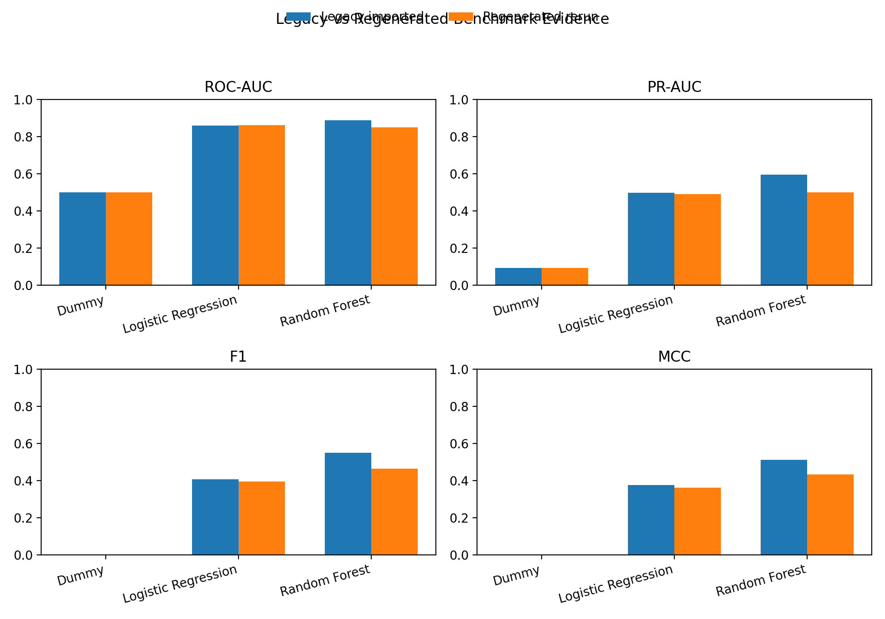
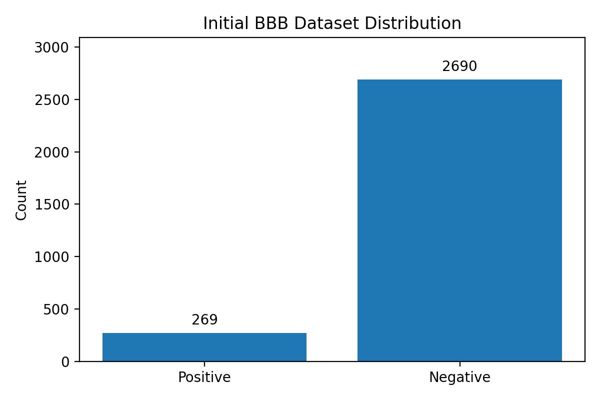
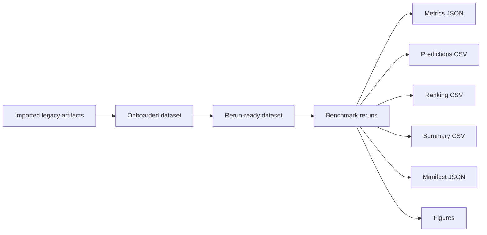
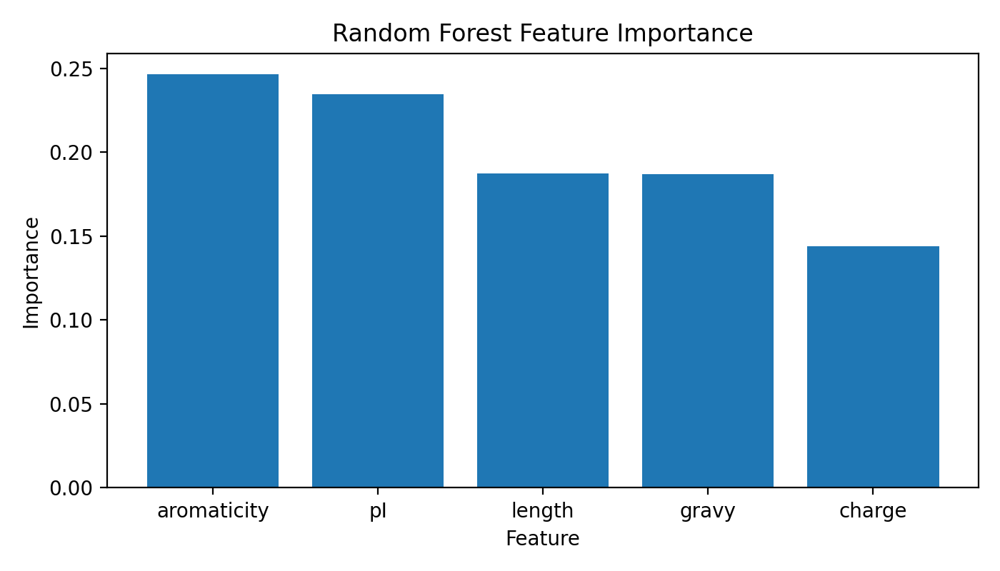
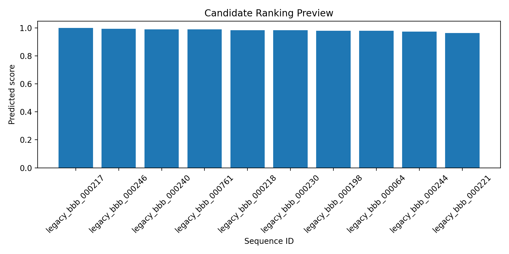

# PERMEA SIGNAL ML

Open benchmark-oriented ML workflow for studying permeability-related signal from sequence-derived physicochemical features.

Permea Signal ML is the first public evidence package in the broader Permea program. It is designed as a reproducible, benchmark-aware workflow for early-stage computational validation and candidate prioritization before experimental validation.

This repository focuses on an initial focus: BBB-oriented peptide and delivery-signal modeling from sequence-derived physicochemical features.

## Why this repository exists

Biological delivery exploration is often difficult to compare across teams, methods, and internal workflows. In many cases, candidate prioritization remains opaque, inconsistently documented, or tightly coupled to closed research pipelines.

Permea Signal ML exists to provide an open and reproducible starting point for studying whether permeability-related signals can be learned from sequence-derived features and used for candidate prioritization in a benchmark-oriented way.

This repository is not intended to present a universal solution to biological delivery. Its purpose is narrower and more practical:

- assemble structured sequence datasets
- compute interpretable sequence-derived features
- run baseline ML models
- evaluate performance with transparent metrics
- produce candidate ranking outputs
- track provenance for reproducibility

## Initial focus

The current v0.1 focus is:

**BBB-oriented peptide / delivery-signal validation**

This focus is intended to provide an initial computational evidence package that is narrow enough to execute, measurable enough to benchmark, and strong enough to support future preprint and validation work.

### Visual snapshot



*Legacy imported benchmark metrics versus regenerated benchmark-contract reruns for Dummy, Logistic Regression, and Random Forest.*

## What this repository does

Permea Signal ML currently focuses on the following workflow surfaces:

- dataset assembly
- sequence validation and preprocessing
- physicochemical feature extraction
- baseline model training
- model evaluation
- candidate ranking
- run manifest and provenance tracking

## What this repository does not claim

This repository does **not** claim:

- solved biological delivery
- validated therapeutic performance
- universal permeability prediction
- replacement of wet-lab validation
- biological generalization beyond the supported evidence

The intended interpretation is more limited and more rigorous:

**This repository provides an open, benchmark-oriented workflow for studying whether permeability-related signal can be learned from sequence-derived physicochemical features and used for candidate prioritization before experimental validation.**

## Current baseline task framing

The current baseline framing is:

- task type: binary classification
- initial context: permeability-related signal / BBB-oriented prioritization
- input object: sequence-level records with labels and metadata
- feature family: sequence-derived physicochemical features
- baseline models:
  - Dummy classifier
  - Logistic Regression
  - Random Forest
- evaluation metrics:
  - ROC-AUC
  - PR-AUC
  - Precision
  - Recall
  - F1
  - MCC

This framing is intended as a benchmark-ready starting surface, not as a final scientific conclusion.

## Initial dataset surface



*Initial BBB dataset distribution showing strong class imbalance in the current benchmark surface.*

## Repository structure

```text
permea-signal-ml/
├─ README.md
├─ LICENSE
├─ .gitignore
├─ requirements.txt
├─ configs/
├─ data/
├─ docs/
├─ figures/
├─ notebooks/
├─ results/
├─ src/
└─ scripts/
```

## More detailed structure

- `configs/`: versioned settings for data, features, models, and evaluation
- `data/`: raw, interim, and processed dataset layers with dataset notes
- `docs/`: methods, dataset, limitations, and provenance documentation
- `figures/`: exported plots for reports or manuscript support
- `notebooks/`: structured exploratory notebooks aligned with the pipeline stages
- `results/`: metrics, predictions, ranking outputs, tables, and run manifests
- `src/`: importable pipeline code for data, features, models, evaluation, and provenance
- `scripts/`: thin CLI entrypoints for baseline runs and export steps

## Benchmark workflow



## Baseline run example

```bash
python scripts/run_baseline.py \
  --data-config configs/data/default.yaml \
  --feature-config configs/features/physicochemical.yaml \
  --model-config configs/models/random_forest.yaml \
  --eval-config configs/eval/default.yaml \
  --output-prefix smoke_test_rf
```

## Reproducibility

This repository is intended to support reproducible workflows by default.

- dataset structure is documented before modeling claims
- configurations are expected to live under versioned config paths
- outputs are separated into metrics, predictions, ranking artifacts, and manifests
- notebooks are present for inspection, but the intended workflow is scriptable and auditable
- provenance artifacts are treated as first-class outputs rather than optional side notes



*Imported legacy Random Forest feature-importance values retained as legacy evidence rather than current regenerated benchmark output.*

## Near-term outputs

- baseline metrics exports
- ranking outputs
- summary tables
- provenance manifests
- figure generation
- preprint-support artifacts



*Top-ranked candidates from the regenerated Random Forest rerun shown as a compact preview rather than a final publication claim.*

## Legacy evidence onboarding status

- imported legacy artifacts are retained as legacy reference material
- regenerated benchmark-contract reruns are now available for Dummy, Logistic Regression, and Random Forest
- dataset version, attribution, and licensing remain pending confirmation
- imported legacy artifacts should not be treated as current benchmark evidence unless rerun under the current contract

## Connection to Permea Core

Permea Signal ML is not the whole Permea platform. It is the first narrow evidence repository in the broader Permea program.

Permea Core defines the public technical foundation, benchmark-first principles, and architecture conventions for the larger effort. Permea Signal ML is a wedge repository that applies those principles to a specific early computational question:

- can permeability-related signal be studied through sequence-derived physicochemical features
- can that signal support transparent candidate prioritization under a benchmark-oriented workflow

This repository should therefore be read as a scoped evidence package connected to Permea Core, not as a claim that the broader delivery problem is solved.

## Status

Status: v0.1 benchmark-contract scaffold

Current default configs point to a synthetic smoke-test dataset and should be replaced or versioned for real benchmark runs.
